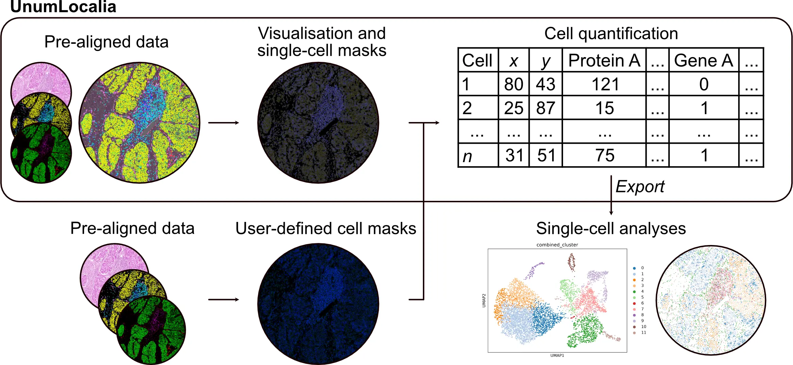

<p align="center">
    
</p>

<p align="center">
    <strong><em>One spatial framework for H&E, Xenium, and COMET data.</em></strong>
</p>

# UnumLocalia

**UnumLocalia** is an open-source Python toolkit for visualising, exploring, and quantifying multimodal spatial biology datasets. It provides an interactive environment for viewing H&E images, COMET protein imaging, Xenium transcripts, and cell segmentations, while supporting cell quantification, segmentation benchmarking, and reproducible analysis workflows — all without modifying the original data.

<p align="center">
    
</p>

---

## Quickstart

**Three steps for non‑programmers**

1. **Install Miniforge and mamba**  
   - Install Miniforge from https://github.com/conda-forge/miniforge and follow the installer for your OS.  
   - Open Terminal and run:
   ```bash
   conda install -n base -c conda-forge mamba
   ```

2. **Create the environment and install UnumLocalia**
```bash
# from the repository root
mamba env create -f environment.yml
eval "$(mamba shell hook --shell zsh)"   # follow printed instructions for your shell
mamba activate unumlocalia
python -m pip install --upgrade pip setuptools wheel build
python -m pip install -e .
```

3. **Download the example dataset and launch UnumLocalia**
    - Download the dataset ZIP from the DOI listed below and extract it to a folder, for example ~/UnumLocalia-dataset.
    - Launch UnumLocalia:
    ```bash
    mamba activate unumlocalia
    unumlocalia
    ```
    - In the Data tab, click **Browse**, select the dataset folder, then click **Load Dataset (Manifest)**.

Example datasets are hosted on Zenodo:
DOI: <INSERT DOI>

---

## Features

| Module | Functionality |
|----------|----------|
| **Viewer** | Interactive napari viewer for H&E, COMET, Xenium transcripts, and cell boundaries |
| **Segmentation** | Load Xenium boundaries or import custom GeoJSON segmentations |
| **Cell Quantification** | Quantify COMET intensities and transcript counts within segmentations |
| **Export** | Save figures (PNG), thresholds (JSON), quantified cells (CSV), and analysis sessions |
| **Session Management** | Save and reload complete analysis sessions |

---

## Supported data modalities

UnumLocalia expects a dataset folder containing:

```
dataset/
    core01_hcc/
        comet/
            comet_thresholding.csv
            core01_comet.ome.zarr
            keypoints_comet.csv
            matrix_comet.csv
        he/
            core01_he.ome.zarr
            keypoints_he.csv
            matrix_he.csv
        xenium/
            cell_boundaries_comet_space.geojson
            cell_boundaries.parquet
            cells.csv
            nucleus_boundaries.parquet
            transcripts.parquet
        
    core02_non_tumour/
        (same as core01)
    core03_tonsil/
        (same as core01)
    core04_hca/
        (same as core01)
    dataset_manifest.csv
```

All files are auto-detected — no manual configuration required.

---

## Installation

### 1. Clone the repository

```bash
git clone https://github.com/Felixillion/UnumLocalia.git
cd UnumLocalia   # set folder location
```

### 2. Create the mamba environment

```bash
mamba env create -f environment.yml
mamba activate unumlocalia
```

### 3. Verify the installation

```bash
unumlocalia --version   # prints version
```

---

## Updating

To update an existing installation:

```bash
cd UnumLocalia

git pull

mamba activate unumlocalia
mamba env update -f environment.yml --prune

python -m pip install -e .
```

New releases may include additional functionality, bug fixes, or performance improvements. Users performing reproducible analyses are encouraged to record the UnumLocalia version used for data quantification and visualisation.

---

## Versioning

UnumLocalia follows semantic versioning:

- PATCH releases (1.0.0 → 1.0.1): bug fixes.
- MINOR releases (1.0.0 → 1.1.0): new functionality.
- MAJOR releases (1.x → 2.0): breaking changes.

To check the installed version:

```bash
unumlocalia --version
```

---

## Quick start

### Launch the GUI

```bash
mamba activate unumlocalia
unumlocalia
```

A napari window will open with the UnumLocalia panel docked on the right.
Go to the **Data** tab, select your dataset folder, and click **Load dataset**.

Alternatively, launch from Python:

```python
from unumlocalia.io import DatasetLoader
```

### Programmatic use

```python
from unumlocalia import DatasetLoader

# Load dataset
loader = DatasetLoader("/path/to/dataset").load(
    do_load_transcripts=False,
    load_boundaries=True,
    load_he=True,
    load_comet=True,
)

# Inspect
print(loader.manifest.summary())
print(f"Genes: {len(loader.genes)}")
print(f"Proteins: {len(loader.proteins)}")
```

## Downstream analysis workflows
UnumLocalia focuses on visualisation, segmentation import, and cell quantification.

Optional downstream analysis script is provided separately in:

```text
analysis/
```
This workflow is intentionally separated from the core package so that UnumLocalia remains lightweight and easy to install.

---

## Repository structure

```
UnumLocalia/
├── unumlocalia/
│   ├── __init__.py                 ← Public API + version
│   ├── cli.py                      ← Version information
│   ├── io.py                       ← Auto-detection, lazy loading, alignment
│   ├── utils.py                    ← Shared math + export utilities
│   ├── viewer.py                   ← napari layer management + cell inspector
│   └── widgets.py                  ← PyQt GUI panels
│
├── analysis/                       ← Analysis workflow
│   ├── environment.yml
│   ├── README.md
│   └── unumlocalia_clustering.py
│
├── images/                         ← Images for README
│   ├── unumlocalia_icon.png
│   ├── unumlocalia_logo.webp
│   └── unumlocalia_workflow.webp
│
├── CHANGELOG.md
├── environment.yml                 ← Mamba environment
├── LICENSE
├── pyproject.toml
├── README.md
└── setup.py
```

---

## Example data

Example datasets, segmentation masks, alignment matrices, thresholds, and example exports are distributed separately through Zenodo.

Large imaging data are not stored in the GitHub repository.

The Zenodo archive contains:

- Example datasets
- OME-Zarr image data
- Alignment matrices
- Threshold files
- Example segmentation masks
- Example UnumLocalia projects

---

## Design philosophy

> Prioritise robustness, usability, and maintainability over the number of features.

- **Never modifies raw data** — everything happens in memory.
- **Lazy loading** — large OME.ZARR images are memory-mapped; only requested tiles are read into RAM.
- **Modular** — each module is independently importable and testable.
- **Reproducible** — quantified cells, thresholds, sessions, and figures can be exported and shared.

---

## Citing UnumLocalia

If you use UnumLocalia in your research, please cite:

> *An open multimodal spatial resource integrating same-tissue transcriptomics, proteomics, and histology.*
> (manuscript in preparation)

---

## License

MIT License — see [LICENSE](LICENSE) for details.
